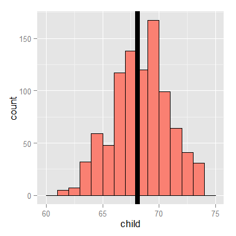
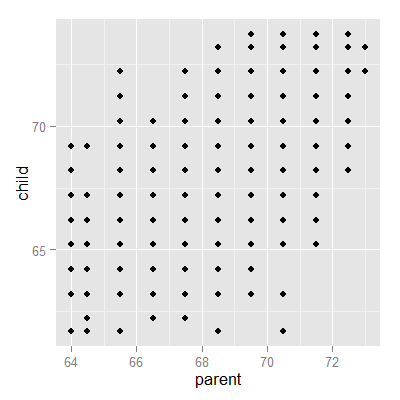
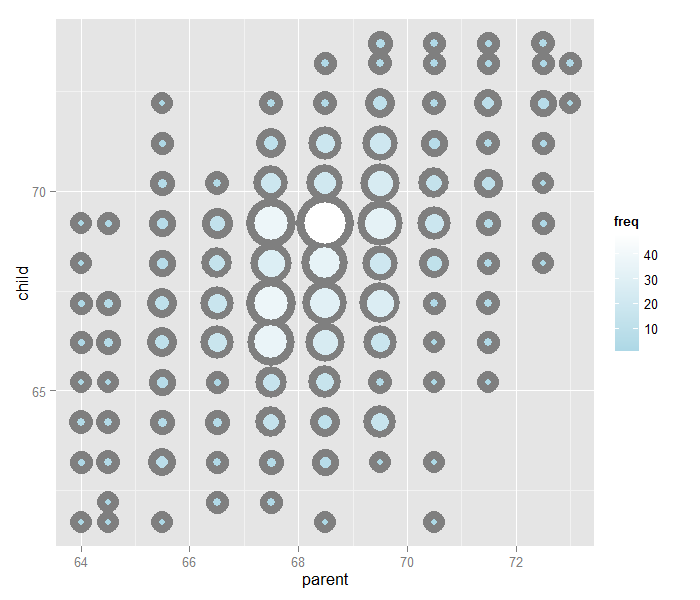
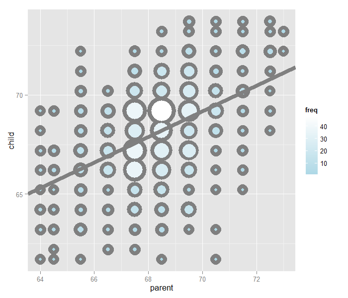

## Before beginning
This book is designed as a companion to the [Regression Models](https://www.coursera.org/course/regmods)
Coursera class as part of the [Data Science Specialization](https://www.coursera.org/specialization/jhudatascience/1?utm_medium=courseDescripTop), a
ten course program offered by three faculty, Jeff Leek, Roger Peng and Brian Caffo,
at the Johns Hopkins University Department of Biostatistics.

The videos associated with this book
[can be watched in full here FIX LINK](),
though the relevant links to specific videos are placed at the appropriate
locations throughout.

Before beginning, we assume that you have a working knowledge
of the R programming language. If not, there is a wonderful Coursera class
by Roger Peng, [that can be found here](https://www.coursera.org/course/rprog).
In addition, students should know the basics of frequentist statistical
inference. There is a Coursera class [here](https://www.coursera.org/course/statinference)
and a [LeanPub book here](https://leanpub.com/LittleInferenceBook).

The entirety of the book is on GitHub [here](https://github.com/bcaffo/regmodsbook).
Please submit pull requests if you find errata! In addition the course notes can be found
also on GitHub [here](https://github.com/bcaffo/courses/tree/master/07_RegressionModels).
While most code is in the book, *all* of the code for every figure and analysis in the
book is in the R markdown files files (.Rmd) for the respective lectures.

Finally, we should mention `swirl` (statistics with interactive R programming).
`swirl` is an intelligent tutoring system developed by Nick Carchedi, with contributions
by Sean Kross and Bill and Gina Croft. It offers a way to learn R in R.
Download `swirl` [here](http://swirlstats.com). There's a swirl
[module for this course!](https://github.com/swirldev/swirl_courses#swirl-courses).
Try it out, it's probably the most effective way to learn.

# Introduction

[Watch this video before beginning FIX LINK]()

## Regression models
Regression models are the workhorse of data science. They the most
well described, practical and theoretically understood models in statistics.
A data scientist versed well in regression models will be able to
solve and incredible array of problems.

Perhaps the key insight for regression models is that they produce
highly interpretable model fits. This is unlike machine learning
algorithms, which often sacrifice interpretability for such things as:
improved prediction performance or automation. These are, of course,
valuable attributes in their own rights. However, the benefit of
simplicity, parsimony and intrepretability offered by regression models
(and their close generalizations) a first tool of choice for any practical
problem.

## Motivating examples

### Francis Galton's height data

Francis Galton, the 19th century polymath, can be credited with discovering
regression. In his landmark paper [*Regression Toward Mediocrity in
Hereditary Stature*](http://galton.org/essays/1880-1889/galton-1886-jaigi-regression-stature.pdf)
he compared the heights of parents and their children. He was particularly
interested in the idea that the children of tall parents tended to be tall also,
but a little shorter than their parents, and children of short parents tended
to be short, but not quite as short as their parents. He referred to this
as "regression to mediocrity" (or regression to the mean). In quantifying
regression to the mean, he invented what we would call regression.

It is perhaps surprising that Galton's specific work on height is still relevant
today. In fact [this European Journal of Human Genetics manuscript](http://www.nature.com/ejhg/journal/v17/n8/full/ejhg20095a.html) compares
Galton's prediction models versus those using modern high throughput genomic
technology (spoiler alert, Galton wins).

Some questions from Galton's data come to mind. How would one fit a model that relates
parent and child heights? How would one predict a childs height based on their
parents? How would we quantify regression to the mean? In this class, we'll
answer all of these questions.

### Simply Statistics versus Kobe Bryant

[Simply Statistics](http://simplystatistics.org/) is a blog by Jeff Leek,
Roger Peng and Rafael Irizarry. It is one of the most widely read statistics
blogs, written by three of the top statisticians in academics. Rafa wrote
a (somewhat tongue in cheek) [post regarding ball hogging](http://simplystatistics.org/2013/01/28/data-supports-claim-that-if-kobe-stops-ball-hogging-the-lakers-will-win-more/) among NBA basketball
players. (By the way, your author has played basketball with Rafael, who
  is quite good by the way, but certainly doesn't pass up shots; glass
  houses and whatnot.)

Here's some key sentences:

- "Data supports claim that if Kobe stops ball hogging the Lakers will win more"
- "Linear regression suggests that an increase of 1% in % of shots taken by Kobe results in a drop of 1.16 points (+/- 0.22)  in score differential."

In this book we will cover how to create summary statements like this using
regression model building. Note the nice interpretability

## Summary notes: questions for this book
Regression models are incredibly handy statistical tools. One can use
them to answer all sorts of question.
Consider three of the most common tasks for regression models:

1. **Prediction** Eg: to use the parent's heights to predict children's heights.
2. **Modeling** Eg: to try to find a parsimonious, easily described mean
    relationship between parent and children's heights.
3. **Covariation** Eg: to investigate the variation in children's heights that appears
  unrelated to parent's heights (residual variation) and to quantify what impact genotype information has beyond parental height in explaining child height.

An important aspect, especially in questions 2 and 3 is assessing
modeling assumptions. For example, it is important to figure out how/whether
and what assumptions are needed to generalize findings beyond the data in question.
Presumably, if we find a relationship between parent and children's  heights,
we'd like to extend that knowledge beyond the data used to build the model.
This requires assumptions. In this book, we'll cover the main assumptions
necessary.

## Exploratory analysis of Galton's Data

Let's look at the data first. This data was created by Francis Galton in 1885.
Galton was a statistician who invented the term and concepts
of regression and correlation, founded the journal Biometrika, and
was the cousin of Charles Darwin.

You may need to run `install.packages("UsingR")` if the `UsingR` library is
not installed. Let's look at the marginal (parents disregarding children and
children disregarding parents) distributions first.
Parent distribution is all heterosexual couples. The parental average corrected
for gender via multiplying female heights by 1.08. Remember, Galton didn't have
regression to help figure out a betetr way to do this correction!
It's also worth noting that overplotting is an issue from discretization
of the heights.

{lang=r,title="Loading and plotting Galton's data.",line-numbers=off}
~~~
library(UsingR); data(galton); library(reshape); long <- melt(galton)
g <- ggplot(long, aes(x = value, fill = variable))
g <- g + geom_histogram(colour = "black", binwidth=1)
g <- g + facet_grid(. ~ variable)
g
~~~

### Finding the middle via least squares
Consider only the children's heights. How could one describe the "middle"?
One definition, let {$$}Y_i{/$$} be the height of child {$$}i{/$$} for
{$$}i = 1, \ldots, n = 928{/$$}, then define the middle as the value
of {$$}\mu{/$$} that minimizes

{$$}\sum_{i=1}^n (Y_i - \mu)^2.{/$$}

This is physical center of mass of the histogram.
You might have guessed that the answer {$$}\mu = \bar Y{/$$}. This is called
the **least squares** estimate for {$$}\mu{/$$}. It is the point that minimizes
the sum of the squared distances between the observed data and itself.

Note, if there was no variation in the data, every value of {$$}Y_i{/$$} was
the same, then there would be no error around the mean. Otherwise, our estimate
has to balance the fact that our estimate of {$$}\mu{/$$} isn't going to
predict every observation perfectly. Minimizing the average (or sum of the)
squared errors seems like a reasonable strategy, though of course there are others.
We could minimize the average absolute deviation between the data and estimated
mean (this leads to the median as the estimate instead of the mean).
However, minimizing the squared error has many nice properties, so we'll stick
with that for this class.

### Experiment
Let's
use rStudio's manipulate to see what value of
{$$}\mu{/$$} minimizes the sum of the squared deviations. The code below
allows you to create a slider to investigate estimates and their
mean squared error.

{lang=r,title="Using manipulate to find the least squares estimate.",line-numbers=off}
~~~
library(manipulate)
myHist <- function(mu){
    mse <- mean((galton$child - mu)^2)
    g <- ggplot(galton, aes(x = child)) + geom_histogram(fill = "salmon", colour = "black", binwidth=1)
    g <- g + geom_vline(xintercept = mu, size = 3)
    g <- g + ggtitle(paste("mu = ", mu, ", MSE = ", round(mse, 2), sep = ""))
    g
}
manipulate(myHist(mu), mu = slider(62, 74, step = 0.5))
~~~

The least squares estimate is the empirical mean.

{lang=r,line-numbers=off}
~~~
g <- ggplot(galton, aes(x = child)) + geom_histogram(fill = "salmon", colour = "black", binwidth=1)
g <- g + geom_vline(xintercept = mean(galton$child), size = 3)
g
~~~

## The math (not required)

Why is the sample average the least squares estimate for {$$}\mu{/$$}?
It's surprisingly easy to show. Perhaps more surprising is how generally
these results can be extended.

{$$}
\begin{eqnarray*}
\sum_{i=1}^n (Y_i - \mu)^2 & = & \sum_{i=1}^n (Y_i - \bar Y + \bar Y - \mu)^2 \\
                           & = & \sum_{i=1}^n (Y_i - \bar Y)^2 + 2 \sum_{i=1}^n (Y_i - \bar Y)  (\bar Y - \mu) + \sum_{i=1}^n (\bar Y - \mu)^2 \\
                           & = & \sum_{i=1}^n (Y_i - \bar Y)^2 + 2 (\bar Y - \mu) \sum_{i=1}^n (Y_i - \bar Y)  + \sum_{i=1}^n (\bar Y - \mu)^2 \\
                           & = & \sum_{i=1}^n (Y_i - \bar Y)^2 + 2 (\bar Y - \mu)  (\sum_{i=1}^n Y_i - n \bar Y) + \sum_{i=1}^n (\bar Y - \mu)^2 \\
                           & = & \sum_{i=1}^n (Y_i - \bar Y)^2 + \sum_{i=1}^n (\bar Y - \mu)^2\\
                           & \geq & \sum_{i=1}^n (Y_i - \bar Y)^2 \
\end{eqnarray*}
{/$$}

## Comparing children's heights and their parent's heights

Looking at either the parents or children on their own isn't interesting.
We're interested in how the relate to each other. Let's plot the parent
and child heights.

{lang=r,line-numbers=off}
~~~
ggplot(galton, aes(x = parent, y = child)) + geom_point()
~~~

The overplotting is clearly hiding some data. [Here you can get the code
](https://github.com/bcaffo/courses/blob/master/07_RegressionModels/01_01_introduction/index.Rmd)
to make the size and color of the points be the frequency.

## Regression through the origin
A line requires two parameters to be specified, the intercept and the slope.
Let's first focus on the slope. We want to find the slope of the line that
best fits the data. However, we have to pick a good intercept. Let's subtract
the mean from bot the parent and child heights so that their subsequent
means are 0.
Now let's find the line that goes through the origin (has intercept 0) by
picking the best slope.

Suppose that {$$}X_i{/$$} are the parent heights with the mean subtracted.
Consider picking the slope {$$}\beta{/$$} that minimizes

{$$}\sum_{i=1}^n (Y_i - X_i \beta)^2{/$$}

Each {$$}X_i \beta{/$$} is the vertical height of
a line through the origin at point {$$}X_i{/$$}. Thus,
{$$}Y_i - \X_i \beta{/$$} is the vertical distance between the line
at each observed {$$}X_i{/$$} point (parental height) and the
{$$}Y_i{/$$} (child height).

Our goal is exactly to use the origin as a pivot point and pick the
line that minimizes the sum of the squared vertical distances
of the points to the line. Use R studio's  manipulate function to experiment
Subtract the means so that the origin is the mean of the parent
and children heights.

{title="Code for plotting the data.", lang=r, line-numbers=off}
~~~
y <- galton$child - mean(galton$child)
x <- galton$parent - mean(galton$parent)
freqData <- as.data.frame(table(x, y))
names(freqData) <- c("child", "parent", "freq")
freqData$child <- as.numeric(as.character(freqData$child))
freqData$parent <- as.numeric(as.character(freqData$parent))
myPlot <- function(beta){
    g <- ggplot(filter(freqData, freq > 0), aes(x = parent, y = child))
    g <- g  + scale_size(range = c(2, 20), guide = "none" )
    g <- g + geom_point(colour="grey50", aes(size = freq+20, show_guide = FALSE))
    g <- g + geom_point(aes(colour=freq, size = freq))
    g <- g + scale_colour_gradient(low = "lightblue", high="white")
    g <- g + geom_abline(intercept = 0, slope = beta, size = 3)
    mse <- mean( (y - beta * x) ^2 )
    g <- g + ggtitle(paste("beta = ", beta, "mse = ", round(mse, 3)))
    g
}
manipulate(myPlot(beta), beta = slider(0.6, 1.2, step = 0.02))
~~~

### The solution
In the next few lectures we'll talk about why this is the solution. But,
rather than leave you hanging, here it is:

{lang=r,line-numbers=off}
~~~
> lm(I(child - mean(child))~ I(parent - mean(parent)) - 1, data = galton)
Call:
lm(formula = I(child - mean(child)) ~ I(parent - mean(parent)) -
    1, data = galton)

Coefficients:
I(parent - mean(parent))  
                   0.646  
~~~

Let's plot the best fitting line. In the subsequent chapter we will learn all
about creating, interpreting and performing inference on such mode fits.

## Exercises
